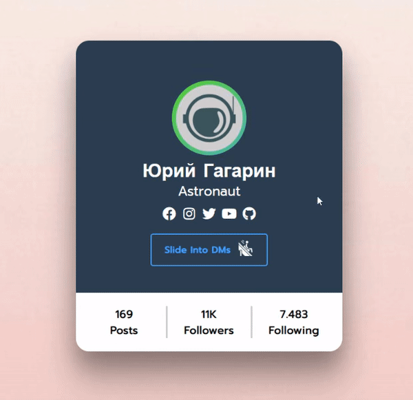

# Account Profile Card (HTML/CSS/JS Frontend Web Dev)
A responsive profile card with a modern and visually appealing design.
It provides a sleek and interactive representation of a user account profile, perfect for personal websites,
portfolio pages, or social media profiles.

## Visual Demonstration

## Features

* **Profile Picutre or Avatar**: The header of the card includes a typically circle-shaped slot where the account user
can display their preferred avatar or profile picture to the rest of the internet. The display has an animated
gradient circle around it which can be used in social media as a sort of indicator that the user has uploaded a story
or post you haven't seen yet.

* **User Information**: Most importantly the account owner's username. Additionally, can be any other piece of relevant information
like age, gender, occupation, status, etc.

* **Social Media**: Cool icons with scaling and coloring effect that directly link to the user's external social
media accounts.

* **Engagement metrics**:  The card includes engagement statistics, such as the number of posts, followers,
and accounts being followed. You can update these metrics to reflect the user's actual engagement data. You can also
further customize these metrics to display the account's posts, who they are following and who is following them back.

* **Direct Message Button**: A "Slide Into DMs" button that provides a funny way for visitors to send direct messages 
to the profile owner. You can customize the button text, and the associated link can be updated to redirect to the
desired messaging platform.

## Web Tools

* **HTML**: Provides the structure and layout.

* **CSS**: Defines the styling rules for the page elements, including the avatar picture, upload button,
and icon pop-up (optional). 

* **JavaScript (optional)**: Implements the functionality for uploading and updating the avatar picture,
as well as managing the appearance of the icon pop-up.

* **Font Awesome**: Popular styling library where social media icons are being referenced from. 

## Get Started

To run this project locally, follow these steps:

1. Clone the repository or download the project files.
2. Keep files in exact folder order and hierarchy. 
3. Open the `index.html` file in your preferred web browser.
4. If you want to have the utility provided in `script.js`,
you need to uncomment the relevant parts inside the `index.html`

## Credits

This project was created by [th0tmaker](https://github.com/th0tmaker) as part of a
[web development](https://github.com/th0tmaker/WebDesign) exercise.
It may serve as a starting point for further enhancements and customizations.