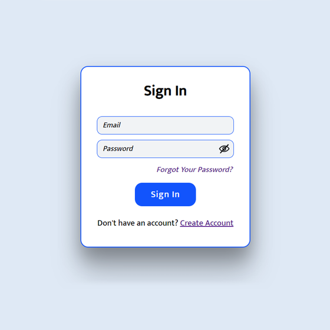
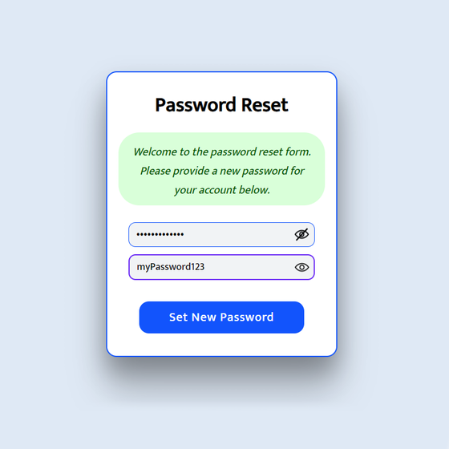

# Authentication Forms (HTML/CSS/JS Frontend Web Dev)

**An authentication form is a user interface element that allows users to sign in, register for a new account,
reset their password, or recover a forgotten password.The following images are my designs of the most typical
authentication forms for a website or application:**

## Sign In Form

*The sign-in form is used to authenticate the identity of an existing user.*

## New Account Form

*The new account registration form is used to create a new user account on the website or application.*

## Password Forgot Form

*The password forgot form is used to allow users to recover a forgotten password by providing their email address.*

## Password Reset Form

*The password reset form is used to allow users to reset the password after they have received a password reset email.*

### In conclusion:

authentication forms are a crucial design component of any website or application that requires user authentication.
They help ensure the security and privacy of users' accounts and personal information.
This design offers a simple and effective way for the user to navigate through the authetication scope.
The password and repeat password fields include a toggle eye icon  that allows the user to show or hide their password
when they are typing it. The form also includes a checkbox for the user to agree to the terms and conditions.
Finally, each form has its own corresponding button and a unique prompt for the user. The code includes a reference to
a JavaScript file called `passwordVisibility.js`, that controls the functionality of the password toggle icons.
Finally, the code references a CSS stylesheet called `style.css`for custom styling and the Font Awesome icon library.