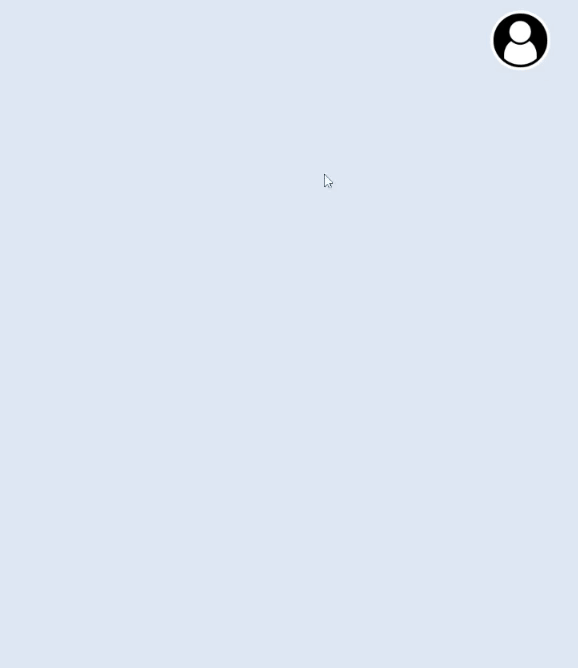

# Avatar Dropdown Menu (HTML/CSS/JS Frontend Web Dev)

**An action avatar/profile picture dropdown menu is commonly used to provide users with quick access to important
account-related actions or features. By placing these actions in a dropdown menu, it helps to keep the interface
uncluttered and allows for more screen space to be utilized for other content.
It also provides a quick and easy way for users to access their most frequent account-related features
without having to navigate through multiple pages or menus.**

## JavaScript Utility:

* `splitDropUsername.js`: Splits a username into two lines of equal character length and displays them in a
web page.

* `toggleAvatarDropMenu.js`: Toggles the visibility of a side menu when an avatar is clicked.
The function uses CSS transitions to fade in or fade out the menu with a specified duration.

* `switchLightDarkTheme.js`: Allows switching between a light and a dark theme based on the user's preference.

## Visual Demonstration

### In conclusion:

Dropdown menus grant users quick and easy access to account settings and features and help increase
engagement and retention on your website. The design on this project combines both clarity and aesthetic appeal. 
The account username is right underneath the user's avatar or profile picture. Below the username you have a line to 
display your activity or important status. The menu features are all neatly ordered by their icon and name
and hovering over a partiular feature with your cursor will give the user a scaling effect for emphasis. 
Finally, at the bottom of the menu we have a toggle switch which gives us a cool and simple way of chaning our website
appearance. With just one click on the switch, you can toggle your website theme from light to dark mode.
