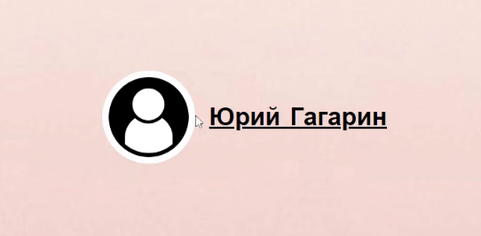

# Avatar Image Upload (HTML/CSS/JS Frontend Web Dev)

In today's fast-paced web design landscape, speed and efficiency are of utmost importance.
This project provides users with the ability to upload their avatar picture in a fast, easy and compact manner.
Users can conveniently upload a new avatar picture directly from their main profile page using a user-friendly pop-up
feature embedded within the avatar itself. With just a few clicks, anyone can select an image from their local storage
and instantly set it as their avatar picture. The website will also remember and save the last image uploaded.
This approach is highly beneficial for social networking platforms, online communities, and other web applications
that prioritize seamless user personalization.

## Visual Demonstration

## Features

* **Avatar Picture Display**: The page displays the user's avatar picture, initially set to a default image.
The avatar picture is presented within a circular container with a white border.

* **Upload Picture Feature**: Users can click on the camera icon or the avatar picture itself to trigger
the file selection dialog. Upon selecting a new image file, the avatar picture is updated to reflect the selected image.

* **Local Storage Integration**: The selected avatar picture is saved in the browser's local storage.
When the user revisits the page, the previously chosen avatar picture is retrieved from local storage and displayed.

* **Interactive Icon Pop-up**: The camera icon appears as a pop-up when the user hovers over the avatar picture.
It provides a visual cue that allows users to understand they can click on the icon to upload a new picture.

## Web Tools

* **HTML**: Provides the structure and layout of the user profile page.*

* **CSS**: Defines the styling rules for the page elements, including the avatar picture, upload button,
and icon pop-up.* 

* **JavaScript**: Implements the functionality for uploading and updating the avatar picture,
as well as managing the appearance of the icon pop-up.

## Get Started

To run this project locally, follow these steps:

1. Clone the repository or download the project files.
2. Keep files in exact folder order and hierarchy. 
3. Open the `index.html` file in your preferred web browser.
4. You should now see the user profile page with the avatar picture and upload feature.

## Credits

This project was created by [th0tmaker]((https://github.com/th0tmaker)) as part of a
[web development]([Markdown Live Preview](https://github.com/th0tmaker/WebDesign)) exercise.
It may serve as a starting point for further enhancements and customizations.